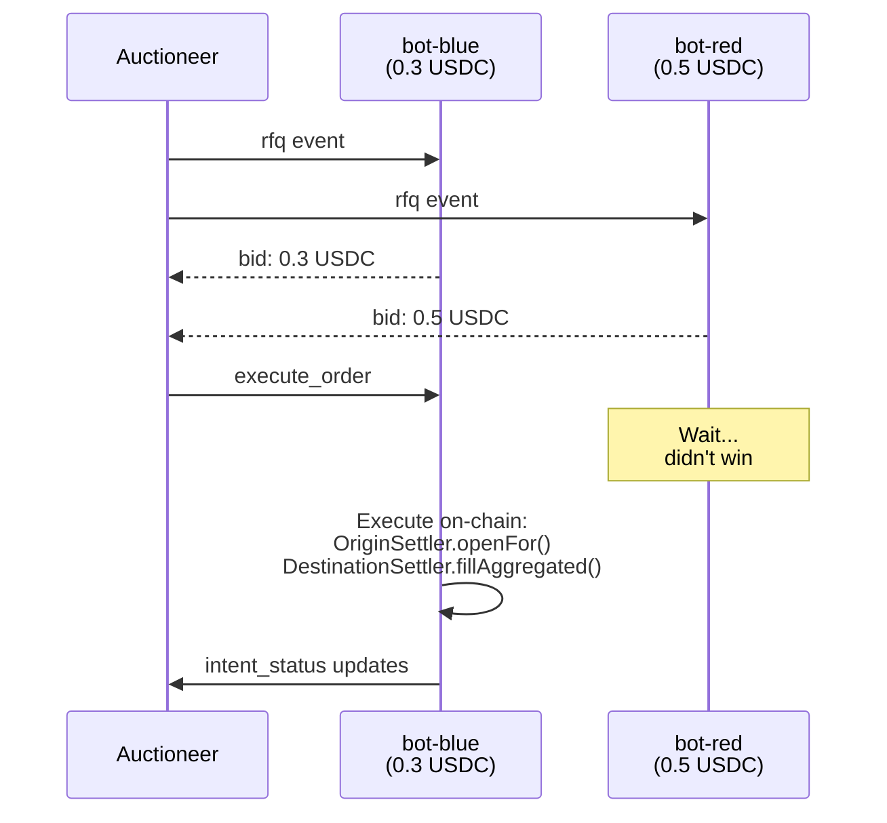
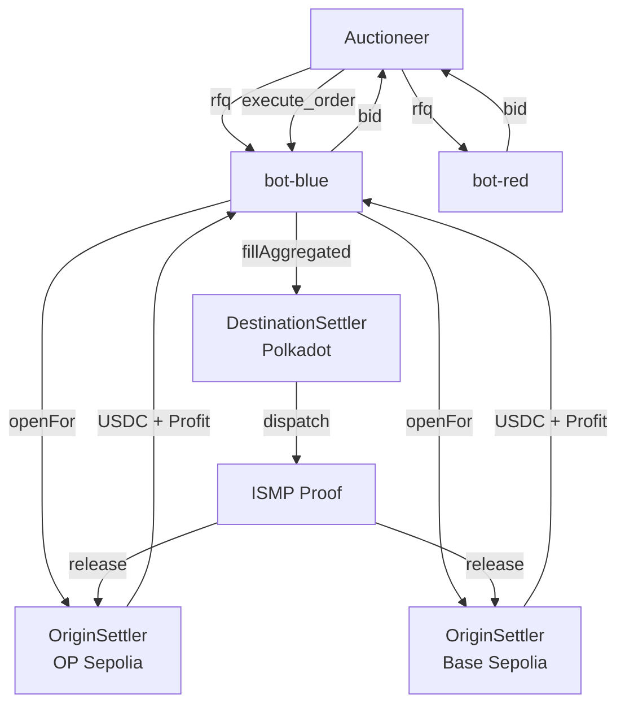

# OmniSpend Solver Bots

Solver bots compete to fill user cross-chain payment intents. They listen for RFQs from the auctioneer, submit bids with their fee, and execute the actual on-chain transactions when they win.

## Overview

There are two solver bots in this demo:

| Bot | Bid Fee | Strategy |
|-----|---------|----------|
| 🔵 **bot-blue** | 0.3 USDC | Aggressive - fastest bid, lowest fee |
| 🔴 **bot-red** | 0.5 USDC | Conservative - slower response |

Both bots connect to the auctioneer via WebSocket and can execute real smart contract transactions on OP Sepolia, Base Sepolia, and Polkadot Paseo.

## How It Works



### Execution Flow

When a solver wins an auction:

1. **Origin Escrow** - Call `OriginSettler.openFor()` on each origin chain (OP, Base) to escrow user's USDC
2. **Destination Fill** - Call `DestinationSettler.fillAggregated()` on Polkadot to execute the target call (e.g., mint NFT)
3. **Status Updates** - Emit `intent_status` events to notify the frontend
4. **ISMP Proof** - Hyperbridge relayers verify the destination execution and release escrowed funds to the solver

## Prerequisites

- Node.js 18+
- Funded wallet on OP Sepolia, Base Sepolia, and Polkadot Paseo
- Running auctioneer server

## Quick Start

### 1. Install Dependencies

```bash
cd solver
npm install
```

### 2. Configure Environment

```bash
cp .env.example .env
```

Edit `.env` with your settings:

```env
AUCTIONEER_URL="http://localhost:3001"

# Your solver wallet (must be funded on all chains)
PRIVATE_KEY="0xyour-private-key"
SOLVER_ADDRESS="0xyour-solver-address"
```

### 3. Run Both Bots (Recommended)

```bash
npm run demo
```

This runs **both** `bot-blue` (0.3 USDC fee) and `bot-red` (0.5 USDC fee) concurrently. Since `bot-blue` bids lower, it will win most auctions.

### 4. Run Individual Bots

```bash
# Run only bot-blue (lower fee = wins more)
npm run bot-blue

# Run only bot-red (higher fee = less profit but safer)
npm run bot-red
```

## Wallet Requirements

The solver wallet needs funds on **all three chains**:

| Chain | Token | Purpose |
|-------|-------|---------|
| OP Sepolia | ETH | Gas for OriginSettler transactions |
| Base Sepolia | ETH | Gas for OriginSettler transactions |
| Polkadot Paseo | USDC | Payment for NFT/mint |
| Polkadot Paseo | USD.h | ISMP relayer gas fees |

### Get Testnet Funds

```bash
# Check balances
npm run check-balances

# Request faucet funds (if available)
npx tsx faucet-fee.ts
```

## Available Scripts

```bash
npm run bot-blue    # Run bot-blue only
npm run bot-red      # Run bot-red only
npm run demo         # Run both bots concurrently
```

## Bot Behavior

### bot-blue (Aggressive)

- Bids **0.3 USDC** fee
- Responds in ~30-80ms (fastest)
- Executes **real on-chain transactions** when `PRIVATE_KEY` is set
- Will win most auctions due to lowest fee

### bot-red (Conservative)

- Bids **0.5 USDC** fee
- Simulates execution only (dry-run mode in demo)
- Good for testing auction mechanics without executing

## Environment Variables

| Variable | Required | Default | Description |
|----------|----------|---------|-------------|
| `AUCTIONEER_URL` | No | `http://localhost:3001` | Auctioneer server URL |
| `PRIVATE_KEY` | Yes* | - | Solver wallet private key |
| `SOLVER_ADDRESS` | Yes* | - | Solver wallet address |

*Required for real on-chain execution. Without them, bots run in dry-run mode.

## Monitoring

### Check Balances

```bash
npm run check-balances
```

### View Bot Logs

When running `npm run demo`, you'll see combined output:

```
[bot-blue] 🔵 Bot BLUE (On-Chain Executor)
[bot-red] 🔴 Bot RED (Simulator)

[bot-blue] ✅ Connected! Waiting for RFQs...
[bot-red] ✅ Connected! Waiting for RFQs...
```

### Auction Flow Example

```
📨 RFQ received!
   Request: rfq-123456789
   User: 0x...
   Output: 8 USDC → Polkadot Paseo
   💸 Bid submitted: fee=0.3 USDC (took 45ms)

🎉🎉🎉 I WON THE AUCTION! 🎉🎉🎉
⏳ [1/2] Executing OriginSettler.openFor() on OP Sepolia...
   ✅ Escrow secured on Origin!
⏳ [2/2] Executing DestinationSettler.fillAggregated() on Polkadot Paseo...
   🚀 ✅ INTENT FULFILLED SUCCESSFULLY ON POLKADOT PASEO!
```

## Troubleshooting

### "No PRIVATE_KEY found in .env"

Bots will run in **dry-run mode** - they participate in auctions but don't execute real transactions. Set `PRIVATE_KEY` in `.env` for actual execution.

### Solver not winning auctions

- `bot-blue` bids 0.3 USDC, `bot-red` bids 0.5 USDC
- `bot-blue` wins by having the lower fee
- Check that `PRIVATE_KEY` is set and wallet is funded

### Connection refused to auctioneer

- Ensure auctioneer is running: `cd ../auctioneer && npm run dev`
- Check `AUCTIONEER_URL` in `.env` matches the auctioneer port

## Architecture



## Integration

Solvers connect via Socket.IO to the auctioneer's `/solver` namespace:

```typescript
import { io } from "socket.io-client";

const socket = io("http://localhost:3001/solver", {
    query: {
        name: "🔵 My Solver",
        address: "0xMyAddress",
    },
});

socket.on("rfq", (rfq) => {
    // Submit bid
    socket.emit("bid", {
        solverAddress: "0xMyAddress",
        solverName: "🔵 My Solver",
        fee: "0.4", // Your fee in USDC
        requestId: rfq.requestId,
    });
});

socket.on("execute_order", async (payload) => {
    // Execute the intent...
    // Emit status updates
    socket.emit("intent_status", {
        requestId: payload.requestId,
        status: "origin_escrow_started",
        message: "Opening escrow..."
    });
});
```

## Contract Addresses

| Contract | Chain | Address |
|----------|-------|---------|
| OriginSettler | OP Sepolia | `0xd2839302132984bE900Fbd769F043721A7d8Bb7C` |
| OriginSettler | Base Sepolia | `0xDc38039f0FB91BF79b4AF1cD83220D1f65b50AaC` |
| DestinationSettler | Polkadot Paseo | `0x67a1d2ce7a2dDb0D8309bdAb33c417Ed5041b35e` |
| USDC | Polkadot Paseo | `0x9Dd96D4BC333A4A3Bbe1238C03f28Bf4a9c8aCAb` |
| Fee Token (USD.h) | Polkadot Paseo | `0x0Dc440CF87830f0aF564eB8b62b454B7e0c68a4b` |
